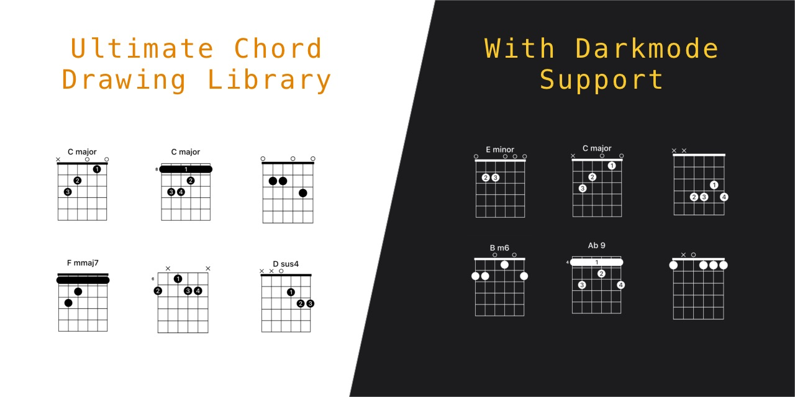

# Swifty Chords


This is a Swift library that can generate CAShapeLayers for any chord within it's database. All you need to do is supply a Key (C, C#, etc) and a suffix (Major, Minor, sus4, etc) to find the appropriate chord. Each chord comes with a few variants. 

The database is pulled from another project I found a while ago, but cannot remember where that was. Please do not rely 100% on this data, as I have found that a few chords are incorrect. If you find any of your own, please open a PR correcting these.

> This library is currently in Beta. Everything works, and the drawing speeds are fine, but there is lots of room for improvement.

I am using this library in my music study app "Mustud" with no problems at all.

## Requirements
- iOS 13+
- macOS 10.12+ -> It works, but you'll need to flip the results since it uses iOS drawing coordinates.
- Xcode 11+

## Installation
Only supports Swift Package Manager at this time.

# Usage
## Setup
```
import SwiftyChords
```

## Search

#### Get all Chords

```
Chords.guitar
```

#### Filter by Key
Returns all chords based on C

```
Chords.guitar.matching(key: .c)
```

#### Filter by Suffix
Returns all major chords in the database.

```
Chords.guitar.matching(suffix: .major)
```

#### Filter by Key and Suffix
Returns all CMajor chords. 
These will be in order of position on the fretboard, starting at the nut.

```
Chords.guitar.matching(key: .c).matching(suffix: .major)
```

## Drawing
There are a number of ways to use the CAShapeLayer. You can add it directly to a view, or convert it to an Image.

To use it, we just need a chord!

```
let chordPosition = Chords.guitar.matching(key: .c).matching(suffix: .major).first!
let frame = CGRect(x: 0, y: 0, width: 100, height: 150) // I find these sizes to be good.
let layer = chordPosition.shapeLayer(rect: frame)
imageView.image = layer.image() // might be exepensive. Use Layers when possible while drawing to a view. Images are better if you plan to reuse or store them somewhere.
```

### Arguments
`rect`: The area for which the chord will be drawn to. This determines it's size. Chords have a set aspect ratio, and so the size of the chord will be based on the shortest side of the rect.

`showFingers`: Determines if the finger numbers should be drawn on top of the dots. Default `true`.

`showChordName` Determines if the chord name should be drawn above the chord. Choosing this option will reduce the size of the chord chart slightly to account for the text. Default `true`.

`forPrint`: If set to `true` the diagram will be colored Black, not matter the users device settings. If set to false, the color of the diagram will match the system label color. Dark text for light mode, and Light text for dark mode. Default `false`.

`mirror`: For lefthanded users. This will flip the chord along its y axis. Default `false`.
